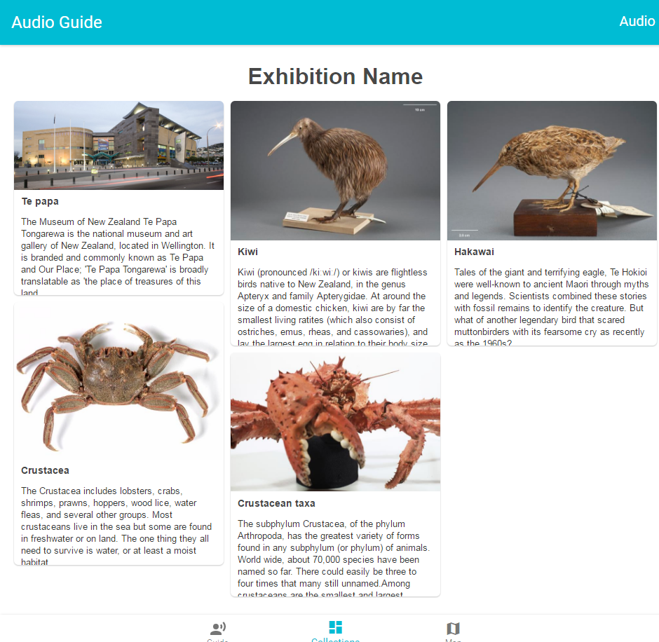

# React-Responsive-Waterfall
A responsive waterfall component to display divs with different heights.

##Install
npm install react-responsive-waterfall

##Dependencies
####Jquery
npm install --save jquery
####Raect
npm install --save react react-dom

##Living demo
http://www.sevenkm.com:8000/#/
Pressing 'Collection' in App to see.

##Screenshot
</img>

##Parameters
####colunmNum
The number of column in waterfall
####images
An array of images displaying in waterfall
